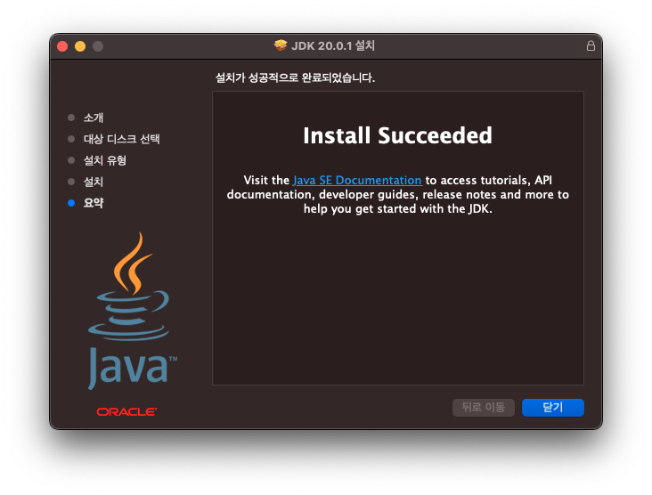

# 1. Java 설치 방법
## 1.1. Java 다운로드

- https://www.oracle.com/kr/java/technologies/downloads/ URL로 이동

* 각자 OS환경에 맞게 MacOS 또는 Windows를 선택
* macOS일 경우 "ARM64 DMG Installer"를 선택 [macOS jdk20 다운로드 링크](https://download.oracle.com/java/20/latest/jdk-20_macos-aarch64_bin.dmg )
* Windows일 경우 "x64 Installer"를 선택 [Windows jdk20 다운로드 링크](https://download.oracle.com/java/20/latest/jdk-20_windows-x64_bin.exe)

## 1.2. java 설치

* 다운로드된 "jdk-20_macos-aarch64_bin.dmg" 파일 더블 클릭
* 설치 진행...

## 1.3. 설치 확인

* 터미널 또는 CMD 실행
* 맥의 경우 command+enter 키를 눌러 "터미널" 또는 "terminal" 입력

* 터미널 또는 CMD 실행 후, `javar --version` 입력 후 아래와 같이 출력되면 설치 완료

# 2. 인텔리제이 설치 방법

## 2.1. 인텔리제이 다운로드

* https://www.jetbrains.com/ko-kr/idea/download/ URL로 이동 후 각 환경에 맞는 "Community Edition" 설치 파일 다운로드

  

## 2.2. 인텔리제이 설치

* 다운로드 파일 실행하여 "IntelliJ IDEA CE" 클릭 이후 우측 "Applications"로 이동하면 설치 완료

* "IntelliJ IDEA CE" 실행

